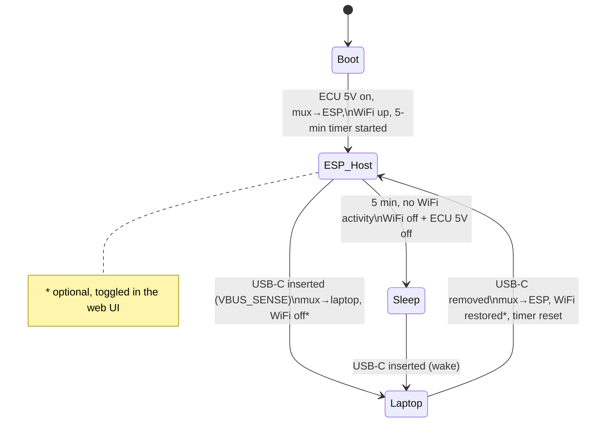

# ⚡ IgnitronUSB

**A wireless USB/IP bridge and live-gauge dashboard for an aftermarket ECU — powered by an ESP32-S3.**

IgnitronUSB lets a Windows device talk to a USB ECU (*Ignitron*) **over WiFi** using the
standard [USB/IP](https://usbip.sourceforge.net/) protocol — no cable to the car
required.  The built-in web dashboard shows live engine gauges. When you *do*
want a wired connection, plug a USB-C cable into the piggyback port and the board
hands the ECU straight to your laptop, automatically stepping the WiFi bridge out
of the way. 

An automotive-grade buck supply runs the whole thing from the car, and
a 5-minute idle timer powers everything down so nothing is left energised.

---

## ✨ Features

- 📡 **Wireless USB/IP bridge** — the ESP32-S3 hosts the ECU on its native USB and
  exports it over a self-contained WiFi soft-AP on TCP `3240`. Attach it on the
  laptop with `usbip` / `usbip-win2`.
- 🔌 **Piggyback USB-C Passthrough** — plug a laptop into the USB-C port and an
  FSUSB42 chip routes the ECU directly to the laptop at full-speed.
- 📊 **Live Web Gauges** — a dark, phone-friendly dashboard served straight from the
  ESP32 over WiFi. Any of the ECU's 384 channels, named and scaled exactly as
  Ignitron's own log viewer shows them (the catalogue is extracted from
  `Ignitron.exe`, and the wire layout is verified byte-for-byte against a real log).
- 🧠 **Automatic USB Switching** — senses USB-C insertion/removal and automatically switches between ESP and USB-C.
- 💤 **5-minute idle shutdown** — with no WiFi activity, the bridge and the ECU 5V
  rail both cut, so the ECU sees an unplugged host and draws nothing.
- 🩺 **Status LED** — at a glance: slow flash = nothing on USB-A, double blink =
  device connected and idle, fast blink = transferring, solid = handed to USB-C.
- 🛠️ **Raw frame tap** — a second TCP port (or the dashboard) records every raw ECU
  transfer, the same format the `tools/` scripts read.

---

## 🔧 Hardware

Custom ESP32-S3 board (WROOM-1-N16, no PSRAM). Power comes from the car through an
input-protected buck (TPS62933, 6.5–24 V → 5 V) and an AMS1117 3.3 V LDO. The ECU
lives on a **USB-A** port whose 5V is a switched high-side rail; a **USB-C** port is
the piggyback laptop connection. Two 5V sources are OR'd through CH213K ideal-diode
e-fuses.

### GPIO map

| GPIO | Net | Direction | Function |
|-----:|-----|-----------|----------|
| **4**  | `ESP_LED`      | out | Status LED (active-HIGH) |
| **5**  | `USB_OE`       | out | FSUSB42 `/OE` — HIGH = mux Hi-Z (USB-A floating) |
| **6**  | `USB_SEL`      | out | FSUSB42 `SEL` — LOW = ESP host, HIGH = laptop (USB-C) |
| **7**  | `IGNITRON_PWR` | out | ECU 5V PMOS gate — **open-drain active-LOW** |
| **8**  | `VBUS_SENSE`   | in  | USB-C VBUS present (Schmitt-buffered), HIGH = C plugged |
| **19** | `ESP_IGNITRON_D-` | — | Native USB D− to ECU (via mux) |
| **20** | `ESP_IGNITRON_D+` | — | Native USB D+ to ECU (via mux) |
| **43** | `TXD0` | out | Serial console TX → CH340 RX |
| **44** | `RXD0` | in  | Serial console RX ← CH340 TX |

> ⚠️ **`IGNITRON_PWR` (GPIO7) is open-drain active-LOW.** Its PMOS gate has a 100 kΩ
> pull-up to +5 V. Firmware enables the rail with `OUTPUT` + `LOW`, and disables it
> by returning the pin to `INPUT` (Hi-Z) so the gate floats to +5 V. **Never drive it
> HIGH** — 3.3 V only partially turns the PMOS on. Reset default (Hi-Z) = ECU off.

### Data mux truth table (FSUSB42)

| `/OE` (GPIO5) | `SEL` (GPIO6) | ECU D± routed to |
|:-:|:-:|---|
| HIGH | x | **Disconnected** (Hi-Z) |
| LOW  | LOW  | **ESP32** host (WiFi bridge) |
| LOW  | HIGH | **Laptop** (USB-C piggyback) |

### Programming / auto-reset (CH340X)

The UART programmer is a **CH340X** (MSOP-10) feeding the classic two-transistor
auto-reset network (DTR → Q1 → `EN`, RTS → Q2 → `IO0`, MMBT3904 + 10 kΩ bases).

> ⚠️ **CH340X pin 6 is `TNOW` by default, not `DTR#`.** With nothing else on the
> pin it outputs a "UART transmitting" flag, so the DTR net never carries DTR,
> Q1 never pulls `EN` low, and esptool's auto-reset silently fails (uploads only
> work by holding BOOT + tapping RESET). The transistor network is *not* the
> problem — a 3904 with a 10 kΩ base only has to sink R10's 0.33 mA.
>
> **Fix: 4.7 kΩ between pin 6 (`TNOW/DTR#`) and pin 5 (`CTS#`).** That switches
> pin 6 to push-pull `DTR#`, idle-high — the polarity the Q1/Q2 network expects.
> The pins are adjacent, so on rev-1 boards bodge a 0603 across the two legs.
> (4.7 kΩ pin 6 → GND selects "open-source" `DTR#`, idle-LOW — wrong for this
> circuit; only use with a direct DTR→IO0 hookup.) Un-NC `CTS#` on the next rev.

Pressing RESET makes the status LED drop out / glow faintly while held — that's
just GPIO4 floating during reset, not a fault.

Refs: [CH340 datasheet (CH340DS1)](https://cdn.sparkfun.com/assets/5/0/a/8/5/CH340DS1.PDF),
[RevK — CH340X DTR/TNOW with ESP BOOT/RESET](https://www.revk.uk/2023/06/ch340x-dtrtnow-with-esp8266esp32-boot.html).

---

## 🧭 How it works — the four stages



| Stage | Trigger | Board does |
|------:|---------|------------|
| **0 — Boot** | Power applied from the car | ECU 5V **on**, mux → **ESP host**, WiFi bridge **up**, 5-min idle timer armed |
| **1 — Bridge** | Laptop joins the WiFi AP / attaches USB/IP | ESP hosts the ECU and exports it over WiFi; idle timer keeps resetting while in use |
| **2 — USB-C in** | Laptop plugged into USB-C (`VBUS_SENSE` HIGH) | Mux → **laptop**, ECU stays powered; WiFi bridge **off** *(optional)* |
| **3 — USB-C out** | USB-C removed (`VBUS_SENSE` LOW) | Mux → **ESP host**; WiFi bridge **restored** *(optional)*; idle timer reset |
| **4 — Idle** | 5 min with no WiFi activity | WiFi bridge **off** + ECU 5V **off** → ECU sees an unplugged host. USB-C wakes it |

"WiFi activity" = a station associated to the soft-AP **or** a USB/IP client attached.

### Status LED (GPIO4)

| Pattern | Meaning |
|---------|---------|
| **Slow flash** (short blip every 1.5 s) | No device connected to USB-A |
| **Double blink** (two short, long gap) | Device connected, no traffic |
| **Fast blink** | Transferring — USB/IP traffic in the last ¾ s |
| **Solid** | Device handed to the laptop over USB-C (ESP not hosting) |
| **Off** | Idle power-down (asleep) |
| **Strobe** | BOOT held 3 s — factory reset armed, press again to confirm |

---

### 🪟 Windows setup (usbip-win2)

The Ignitron ECU uses a **Microchip USB device that with the `libusb-win32` driver** (installed
by the Ignitron tuning software / Zadig). Over WiFi it appears as a *virtual* USB
device, so you need the USB/IP client **and** that same driver bound to it.

1. **Install the USB/IP client** — [usbip-win2](https://github.com/vadimgrn/usbip-win2).
   Its VHCI driver is test-signed, so from an **admin** prompt:

   ```powershell
   bcdedit /set testsigning on   # then reboot
   .\usbip.exe install           # run from the extracted release: installs vhci + cert
   ```

2. **Join** the `IgnitronUSB` WiFi network (open by default — no password).
3. **List, then attach** the exported ECU:

   ```powershell
   usbip list   -r 192.168.1.1        # should show bus id 1-1
   usbip attach -r 192.168.1.1 -b 1-1
   ```

4. **Driver Binding** — the virtual device carries the ECU's real Microchip VID/PID,
   so Windows binds the existing `libusb-win32` driver automatically and it shows up
   under *libusb-win32 devices* in Device Manager, exactly like a local connection.
   If it instead appears needing a driver, run **Zadig** once and install
   `libusb-win32` for that device.
5. **Launch the Ignitron software** — it finds the ECU as if plugged in locally.
6. **Detach** when done: `usbip detach -p 0`.

## 📶 Using the WiFi bridge

1. Join the WiFi network **`IgnitronUSB`**. By default it is an **open** network
   (no password). You can set an SSID and password later from the **Settings** tab.
2. The board is at **`192.168.1.1`**.
3. Attach the ECU on your laptop:

   ```bash
   usbip attach -r 192.168.1.1 -b 1-1
   ```

4. Open the dashboard at **<http://192.168.1.1>**.

### Supported USB devices

The bridge is class-agnostic: whatever the ESP32-S3 full/low-speed host can
enumerate is exported unchanged, and the driver on the laptop talks to it as if
it were local. Verified transfer paths cover **mass storage**, **HID** (keyboards,
mice — interrupt-IN URBs stay pending indefinitely, as the HID stack expects),
**printers** (large bulk-OUT jobs are streamed straight from the socket, no size
limit), **CDC / FTDI / vendor serial cables** (short vendor control reads, the
always-pending bulk-IN read) and **vendor bulk devices** such as the ECU, including
composite devices and interfaces with alternate settings.

Four standard requests are handled on the bridge rather than forwarded raw —
`SET_CONFIGURATION`, `SET_INTERFACE`, `CLEAR_FEATURE(ENDPOINT_HALT)` and the
`SET_FEATURE(PORT_RESET)` a USB/IP client sends to mean "reset this device"
(usbip-win2 issues it for every Windows `IOCTL_INTERNAL_USB_RESET_PORT`, e.g.
FTDI's `FT_ResetPort` and the FTDI driver's own error recovery) — exactly the set
the Linux `usbip` stub driver intercepts. Each resets endpoint data toggles on
the device, and ESP-IDF can only mirror that by tearing down and re-creating the
interface's pipes; the bridge does that transparently, cancelling and
resubmitting any URB a driver keeps parked on the interface meanwhile.

Limits: one device at a time, no isochronous endpoints (audio/video), at most
7 data endpoints (DWC host-channel count), and IN URBs up to 64 KB.

### The gauge protocol — proven, not fitted

Ignitron's PC software polls the ECU with one vendor control request and reads
the answer from bulk-IN endpoint 1. Every poll cycle is two of these:

| control request (`bmRequestType 0x40, bRequest 0xFA, wIndex 0x0800`) | bulk-IN reply |
|---|---|
| `wValue=2, data[0]=0x09` (9 × 8-byte words) | 8 B header, then **64 B** = channels **0..31** |
| `wValue=3, data[0]=0x59` (89 × 8-byte words) | 8 B header, then **704 B** = channels **32..383** |

Both blocks are plain arrays of little-endian `u16`, one per channel, in the
same channel order Ignitron's own `.ilf` logs use (`Data` block index). No sync
word, no checksum: the transfer boundary is the framing. The 64 B block is the
knock/lambda DSP's variables; the 704 B block is everything else.

The channel catalogue itself — name, unit, decimals, multiplier, offset and
dial range for all 384 channels, plus the 303 "status bit" definitions — is
not reverse-engineered from data at all. It is read straight out of the
installed `Ignitron.exe`, which carries it as a Windows string table
(ID `6000 + channel`, plus `7000 + n` for `name, channel, bit`) and a
`float[512][7]` table next to the code that formats values for the log viewer:

```
engineering = (raw × mult + offset) / 10^decimals     raw = int16 if the display minimum < 0, else uint16
```

`tools/verify_map.py` then checks the whole thing against a real session: a
tapcap capture (`session1.bin`) and the Ignitron log recorded at the same time
(`logs/Adam_Forbes_20260914_1842_.ilf`), paired sample-for-frame on the ECU's
own frame counter (channel 347). Result:

| channels | verdict |
|---:|---|
| 144 live | **bit-identical** to the logged value at every paired sample |
| 236 constant | same constant on the wire |
| 4 (32, 381, 382, 383) | computed by the PC into the log (AFR = λ × stoich, USB timing, timestamp); the ECU sends 0 |

and the viewer's displayed values (`tools/ignitron_channels.txt`, transcribed
at one cursor) reproduce from the log's raw values with the exe's table for
every channel whose value wasn't jittering between samples.

Regenerating the firmware table from scratch:

```powershell
py tools/ignitron_exe_extract.py          # Ignitron.exe -> tools/ignitron_channels.csv + ignitron_bits.csv
py tools/verify_map.py LOG.ilf CAPTURE.bin # optional: prove it on a fresh session
py tools/make_channel_map.py               # -> tools/channel_map.csv (keys, groups, defaults)
py tools/gen_gauges.py                     # -> include/gauges_table.h
```

Caveats worth knowing: the exe rewrites a few table rows at runtime from the
loaded tune (the CAN torque channels are re-scaled to the tune's MDI torque
value, user-defined sensors get their own calibration), so those rows carry the
compile-time defaults; and the viewer converts km/h to mph when told to, the
ECU always sends km/h.

### Session handshake, tune reads and the "password protect" feature

The same exe read routine that polls live data also does the session start
and the tune download, so all of it is now understood from the code rather
than guessed from captures:

- **Session start** (what `/api/launch` replays): `E0` read of bank 1 word 0,
  `E2` reads of bank 1 words 5 and 0x141, `E4` read of word 0x100, then four
  `F2` "select address" writes each followed by an `E2` 8-byte read at bank
  2/3 words 0x40 and 0x140. These are the bootloader/firmware versions of the
  ECU's three processors (bank 1 = COM, 2 = DSP, 3 = CPU; Ignitron's firmware
  manager prints them as byte1.byte0, e.g. CPU firmware V1.28) - decoded and
  shown on the Diag tab. The PC only reads them. Then one `FA` write (`wValue 0x0083`, `wIndex 0x0AE8`) whose
  data stage is the single 16-byte bulk-OUT seen in every capture: it clears
  the host→ECU mailbox that *realtime override* later fills. After that the
  PC polls `FA` continuously; nothing else is required to keep data flowing.
- **Reply framing, as measured on the wire** (`tools/launch_monitor.py`,
  `launch.bin`): the ECU streams each reply in whole 64-byte packets. The 8
  header bytes and the first 56 bytes of the block share the first packet, and
  the tail is padded to a packet boundary with whatever memory follows:
  712 → 768 bytes for the main block, 72 → 128 for the DSP block. The firmware
  reads the padded reply as one transfer and takes the block from byte 8
  (`gauge_poll_task`). Ignitron.exe reads "8 bytes, then the block", which only
  lands aligned because the Windows host drops the remainder of that first
  packet; ESP-IDF hands over the whole packet, which is how the first standalone
  attempt fed the decoder a block shifted by 56 bytes.
- **Obfuscation, not encryption**: the tune (`F9` reads) and the bank-2/3
  identity words are XORed with a keystream derived from a per-bank constant
  and the word address (`tools/ignitron_tune.py` has the transcription and
  proof). The live-data blocks are plain. The Vehicle / Owner / Tuner / Notes
  strings are **not** in the ECU at all: every capture was searched raw and
  decoded, and they only exist in the PC-side `.isf` (`tools/isf_parse.py`).
- **Fault memory** (Logging tab → *Read* / *Clear fault memory*), from the
  exe's parser and a captured Ignitron read/clear (`faults1.bin`): the DSP
  table is 512 B at bank 2 word 0x200 and the CPU table 1024 B at bank 3 word
  0xC00, read with `FB` from the word before each (0x1F8 / 0xBF8, whose bytes
  6..7 are a counter). Tables are 32-byte pages of three 5-word records plus a
  u16 checksum of the page's other 30 bytes; a record is
  `[code, rpm, load ×0.1 %, value, (count−1)<<12 | duration]` and code 0xFFFF
  is an empty slot. Clearing writes 0xFF over both tables (`FB` with
  `wValue = bank | 0x80`, data as one bulk-OUT), reads them back, then commits
  per bank: `F3` writes `00 00 AA 55 …` at word 0x960 (DSP) / 0xAE0 (CPU),
  `F4` + `E4` read it back. Names come from Ignitron's own fault table
  (`data/faults.js`, generated from the exe string table).
- **Password protection** is a set of bits in channel 36 (`Protection
  against firmware upgrade / ECU write / ECU read / reading live data / ...`,
  see `tools/ignitron_bits.csv`). On this ECU they are all clear. The bridge
  itself is transparent, so a protected ECU still works through Ignitron; the
  standalone gauge poll would be refused by an ECU with *reading live data*
  protected, and the unlock exchange has not been traced.

Status: on hardware (2026-09-15) the identity replay completes and the ECU
answers every poll; the framing fix above is what was missing. When a launch
fails, `/api/launch` (and the
message beside the button) says exactly why - no ECU enumerated, a USB/IP
client attached, or which step got no reply / a stall - and
`tools/launch_monitor.py` records the whole exchange over WiFi and diffs it
against the PC's session:

```powershell
py tools/launch_monitor.py               # opens the tap, presses Launch, prints every control step
py tools/launch_monitor.py --no-launch   # just watch while Ignitron on the PC opens the session
```

### Raw frame capture

Every ECU transfer (bulk IN/OUT and the vendor control requests that make up
the session handshake) is copied into a record stream. There are two ways to
record it, both producing the same file format so all the `tools/` scripts
read either:

**From the dashboard (no software needed)** — *Diagnostics → USB capture*.
Press **Start**, do whatever you want recorded, type a note and **Add** whenever
something changes (`idle`, `WOT 3rd`, `AC on`…), press **Stop**, then
**Download .bin**. The recording lives in the browser tab, so stay on the page
while it runs.

**From a laptop** — a second TCP port (`3241`) streams the same records:

```bash
py tools/tapcap.py 192.168.1.1 capture.bin --quiet      # type a note + Enter to mark
nc 192.168.1.1 3241 > capture.bin                        # or just dump it
```

Only one recorder can be attached at a time (the dashboard refuses to start
while a TCP client is connected, and vice versa). Record format, all
little-endian: `u8 0xEC, u8 dir (0 OUT / 1 IN / 0xFF note), u8 ep, u8 flags,
u32 t_ms, u16 len, payload[len]`. `tools/gauge_lab.py trace` prints one as a
timeline; `tools/ilf_parse.py` reads the Ignitron `.ilf` logs.

---

## 🖥️ Web Dashboard

The dashboard polls `/api/status` (~10 Hz) and is split into three tabs:

- **Dashboard** — animated radial gauges: a big top dial (RPM by default, selectable) plus
  whatever channels are ticked on the Gauges tab. In the flat layout, drag a dial to
  reorder (press and hold first on a phone); the order is saved on the board.
- **Settings** —
  - **WiFi access point**: edit the **SSID** and **password**. Leave the password
    blank for an **open** network; a password, if set, must be **≥ 8 characters**
    (WPA2 minimum). Saving stores the credentials in NVS and reboots the device to
    re-broadcast the AP.
  - **Bridge behaviour**: **USB-C disables WiFi bridge** (stage 2) and
    **Restore WiFi bridge when USB-C unplugged** (stage 3), plus **Wake / keep alive**.
  - **Factory reset**: restore the open `IgnitronUSB` AP (no password) at `192.168.1.1`.
- **Diag** — system chips (USB-C / ECU 5V / route / auto-off countdown), the ECU's
  own COM/DSP/CPU bootloader + firmware versions, plus board firmware, free heap,
  ECU link, frame count and the AP SSID/IP.

Settings are stored in EEP.

### Logging

The **Logging** tab records any subset of the ECU's channels — its own selection,
independent of the dashboard's 16-dial cap (any number of channels up to all 384,
1–20 Hz; *Select main* takes every measurement and leaves out the 29 status-bit
words, *Select all* takes everything):

- **On the board**: rows go to the board's flash (`/logs/log_NNNN.ilg`, ~4 + 2 bytes
  per channel per row) through a ring buffer and a low-priority writer, flushed every
  2 s, so a power cut costs at most that. Give a log a name or take the running
  number; logs accumulate until deleted (per-file or *Clear all logs from flash*),
  and the tab shows a flash-usage bar plus a live estimate of how long the free
  space lasts at the current selection and rate. Survives closing the page. Download as
  **CSV** (built on the fly with the registry's names/units/scaling) or the raw
  file. Budget: 20 channels at 10 Hz ≈ 1.6 MB/hour; all 384 at 10 Hz ≈ 28 MB/hour,
  i.e. ~7 minutes of the ~3.3 MB free — pick a lower rate for full-catalogue logs
  on the board, or log in the browser. The tab shows free flash.
- **In this browser**: the page polls `/api/log/sample` at the chosen rate. Where
  the browser supports it (Chrome/Edge) rows stream straight into a file you pick;
  otherwise they're held and saved as CSV when you stop.

**Parameters** export/import (same tab) saves the dashboard gauge set, layout,
hero dial and the logging channel set + rate as a small JSON file.

### Factory Reset

Besides the **Settings → Factory reset** button: hold **BOOT** for **3 s** until the
LED strobes, **release, then press it again** within 3 s. That wipes the WiFi
credentials, routing override and behaviour settings and reboots to the open-AP
defaults. Holding it without the confirmation press does nothing.

> The **EN** button is the ESP32 hardware reset (`CHIP_PU`) and cannot be read by
> firmware, so **BOOT** (GPIO0) is used instead. GPIO0 is also driven by the
> console CH340's DTR line, which is why a plain long-press is not enough — a
> serial terminal asserting DTR would otherwise factory-reset the board.

### HTTP API

| Method | Route | Purpose |
|--------|-------|---------|
| `GET`  | `/api/status` | Telemetry + board/system state (JSON). `ch` = legacy fixed channels, `g` = enabled registry gauges, `ident` = ECU bootloader/firmware versions (COM/DSP/CPU) |
| `GET`  | `/api/gauges` | Gauge registry: every channel with label/unit/range/decimals/group/type and its ECU channel index, plus on-state and whether the ECU sends it |
| `POST` | `/api/gauges?key=..&on=0\|1` | Show/hide one gauge (persisted) |
| `POST` | `/api/gauges?arrangeByType=0\|1` | Group the dashboard into Basic/Ignition/Knock/Injection/Advanced, or one flat grid |
| `POST` | `/api/gauges?sweep=0\|1&autoLaunch=0\|1&hero=key&order=k1,k2,…` | Dashboard preferences: needle sweep on connect, launch on page open, top dial, flat-grid order (all persisted) |
| `POST` | `/api/launch` | Replay the captured session handshake, then start the standalone gauge poll |
| `POST` | `/api/unlaunch` | Stop the standalone gauge poll |
| `GET`  | `/api/faults` | Read the ECU's stored fault memory (needs gauges launched, no USB/IP client) |
| `POST` | `/api/faults/clear` | Wipe and commit the fault memory, as Ignitron's Clear button does |
| `WS`   | `/ws/capture` | Raw USB record stream (binary frames, tapcap format); text frames sent up become `0xFF` note records. One client at a time |
| `GET`  | `/api/ota/info` | Firmware version, board and chip revision |
| `POST` | `/api/ota` | Firmware image upload (`firmware.bin` → `U_FLASH`), reboots when done |
| `POST` | `/api/ota/fs` | Filesystem image upload (`littlefs.bin` → `U_SPIFFS`), does **not** reboot |

### 📦 OTA updates

The **OTA** tab updates the board over WiFi, no cable needed — the same
`ota_manager` module used across the other Forbes Automotive ESP32 projects.

It is deliberately **two-stage**, and the order matters:

1. **Filesystem** (`littlefs.bin`) — the web UI. Written to the spiffs
   partition; deliberately does *not* reboot.
2. **Firmware** (`firmware.bin`) — the application. Written to the inactive OTA
   app slot, then the board reboots.

Doing the filesystem first means the new UI and the firmware that serves it
arrive together on the single reboot at the end, instead of a rebooted board
briefly serving a stale UI. The tab tracks which stage is done (persisted
briefly in the browser, so the indicator survives the reboot) and pre-selects
the firmware step when you come back.

Build the two images with `pio run` and `pio run -t buildfs`; they land in
`$SYSTEMDRIVE/.platformio/ignitronusb-pio/build/ignitronusb-idf/` as
`firmware.bin` and `littlefs.bin`.

An upload also holds off the 5-minute idle watchdog (`otaInProgress()` feeds
`compute_wifi_in_use()`), so the radio and ECU rail can't be cut mid-write.
| `GET`  | `/api/wifi` | Current AP SSID, whether secured, and IP |
| `POST` | `/api/wifi?ssid=..&password=..` | Set AP credentials (blank or ≥ 8-char password) and reboot |
| `POST` | `/api/factory` | Restore factory defaults (open AP) and reboot |
| `POST` | `/api/settings?usbcDisablesWifi=1&restoreWifiOnUnplug=0` | Update + persist toggles |
| `POST` | `/api/wake` | Re-power the ECU and restart the idle timer |
| `GET/POST` | `/api/log/config` | Logging channel set (`channels=12,15,…` ECU indices) and `rate` |
| `POST` | `/api/log/start[?name=…]`, `/api/log/stop` | Device logging (optional file name) |
| `POST` | `/api/log/clear` | Delete every stored log (except one being written) |
| `GET`  | `/api/log/status` | Running state, rows/bytes, flash free, stored files |
| `GET`  | `/api/log/download?name=…&fmt=csv\|raw` | Download a log (CSV converted on the fly) |
| `POST` | `/api/log/delete?name=…` | Delete a stored log |
| `GET`  | `/api/log/sample` | One row of the logging channel set (browser-side logging) |
| `GET/POST` | `/api/params` | Export / import dashboard + logging parameters (JSON) |

---

## 🔨 Building

Two PlatformIO environments build the same sources:

| env | what | when |
|-----|------|------|
| `ignitronusb-idf` (default) | Arduino core compiled as an ESP-IDF component, honouring [`sdkconfig.defaults`](sdkconfig.defaults): 32 KB lwIP TCP windows (fast-retransmit instead of 0.5–1 s stalls on a lost WiFi frame), USB-host tuning, selective Arduino compilation | normal use |
| `ignitronusb` | precompiled Arduino core (5.7 KB TCP windows) | fallback |

```powershell
pio run                              # default env (arduino+espidf)
pio run -t upload                    # flash it
pio run -t uploadfs                  # flash the web UI (data/) — after any UI change
pio run -e ignitronusb -t upload     # fallback env
```

Notes for the `-idf` env:

- Run it from **PowerShell / the VS Code terminal**, not Git Bash — ESP-IDF's tool
  installer refuses MSYS shells.
- The first build downloads ESP-IDF, CMake, Ninja and the toolchain (~1 GB) and
  compiles the whole IDF; later builds are incremental (~1 min).
- The IDF component manager is **off** ([`scripts/pio_pre_idf.py`](scripts/pio_pre_idf.py)):
  its `managed_components/` churn collides with Google Drive sync. The Arduino
  core's optional managed components are compiled out via
  `CONFIG_ARDUINO_SELECTIVE_*`, and the one this firmware needs
  (`joltwallet/littlefs`) is vendored under [`components/`](components/).
- If a build fails at the **link** step with `cannot find .../src/*.cpp.o` right
  after the sources compiled, run `pio run` again — the hybrid builder sometimes
  links before freshly compiled app objects land; the second pass is clean.
- `sdkconfig.defaults` is generated from the exact sdkconfig the precompiled core
  was built with, plus the overrides marked at the top; the effective config lands
  in `sdkconfig.ignitronusb-idf` (generated, ignored).

## 🐛 Debugging

Tagged, per-subsystem serial debug is configured in [`include/defs.h`](include/defs.h)
(`enableDebug` master switch; `[SYS] [WiFi] [USB] [ECU] [TAP] [WEB]` tags). Per-URB
tracing of the USB/IP bridge is a separate switch, `USBIP_TRACE_URBS` in
`platformio.ini` — keep it off unless debugging, it slows the bridge enough to
break serial-adapter drivers. A 1 Hz line summarises key state:

```
[SYS] clients=1 heap=210448 | ECU link=1 frames=1234 in=4096B out=512B drop=0 cap=0 | usbc=0 ecu5v=1 wifi=1 mux=1 idle=248s
```

---

## 🙏 Credits & License

- USB/IP + USB-host core ported from
  [tiehfood/esphome-usbip-printer](https://github.com/tiehfood/esphome-usbip-printer)
  (GPL-3.0) — printer specifics removed, generic vendor-USB support retained.
- Dashboard styling inspired by the **Can2Cluster** / **OpenHaldex** projects.

Licensed under **GPL-3.0** — see [`LICENSE`](LICENSE).
